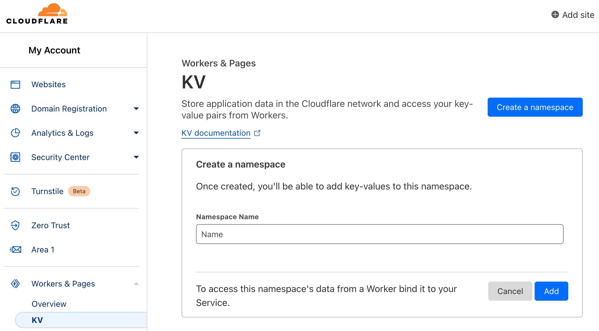
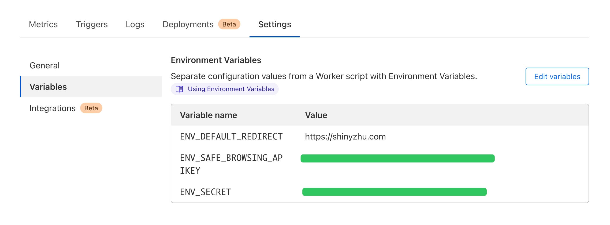
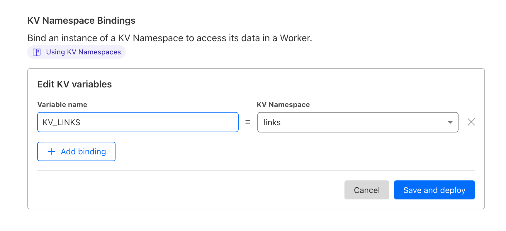

# URL-Shorten-Worker
A URL Shortener created using Cloudflare Worker.

This updated version only support API. **No web UI provided.**

## API Documentation

See [API Documentation](docs/API.md)

## Deploy your own shortener

You need to login to Cloudflare to get started.

### 1. Create a KV namespace

To store shorten links, you need to first create a KV namespace. Let's say `links` for example.

### 2. Create a Worker application 

The worker is the app that shorten your long URLs. You can create a "Hello World" Worker. We'll edit the script later.

### 3. Edit the Worker settings

Open your Worker page. Switch to the `Settings` tab.

We need to set the Variables for shortner.

#### 3.1 Add variables

We need these variables:

`ENV_DEFAULT_REDIRECT`: If someone directly visit your shortner page, then redirect to this URL.

`ENV_SAFE_BROWSING_APIKEY`: If you enabled Google Safe Browsing, you need to set your own API KEY here.

`ENV_SECRET`: The secret string for protecting your shortener API.

#### 3.2 Bind KV namespace

Scroll down in the `Settings` tab of the Worker page.

Input the variable name `KV_LINKS`, and select your KV namespace in the dropdown list. Then click `Save and deploy`.

### 4. Edit the script of the Worker

In the Worker page, click the `Quick edit` button to open the script editor.

Copy all the code from file `index.js` and paste to the file `worker.js` in the editor.

Then click the `Save and deploy` button. Or you can do some test in the editor.

### 5. Ready to roll

Now it's ready to work.

You can edit the file `shortener.sh` to call the API from bash.

## Web Demo by xyTom

https://lnks.eu.org/

Note: Because someone abuse this demo website, all the generated link will automatically expired after 24 hours. For long-term use, please deploy your own.

注意：所有由Demo网站生成的链接24小时后会自动失效，如需长期使用请自行搭建。
